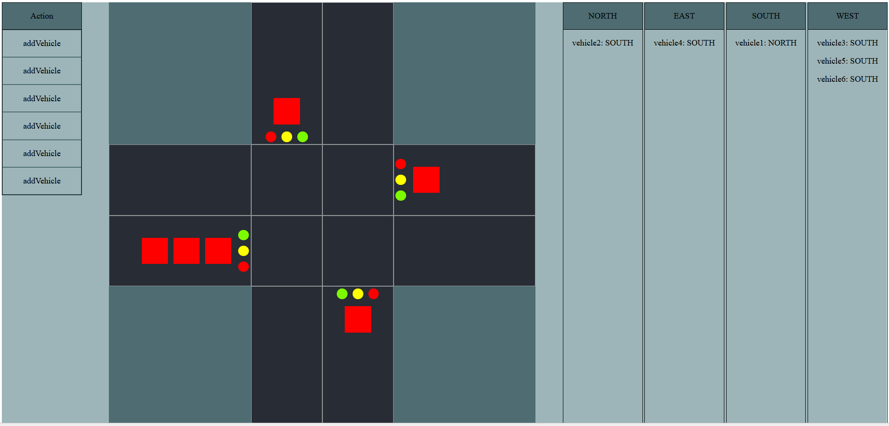

# Signalized Intersection Simulator

**Technologies Used:**  
- **Backend:** Java, Spring Boot  
- **Frontend:** JavaScript, React  

---

## About

This project is a **Signalized Intersection Simulator** that lets you simulate vehicle traffic at an intersection. The simulator reads commands from a `.json` file to control the vehicles. There are two types of commands:

- **Add Vehicle** – Adds a new vehicle to a specific road.  
- **Step** – Advances the simulation using the traffic light algorithm described below.

Every time a `Step` command is processed, the program updates which vehicles can move and which traffic lights are green or red.

---

## How the Simulation Works

The simulator uses a **priority-based traffic algorithm**:

1. **Sort Roads by Priority:**  
   - Each road gets a priority score*  
   - Roads with higher priority get green lights first.
  
   *priority score = number of vehicles × waiting time of the first vehicle

2. **Set Traffic Lights:**  
   - Turn on the green light for the highest-priority road.  
   - For the other roads, check if letting the first vehicle move would collide with vehicles that already have a green light.  
   - If there’s a conflict, the light stays red; if not, it turns green.

3. **Repeat for All Roads:**  
   - Continue down the sorted list until every road has been processed.

4. **Move Vehicles:**  
   - Vehicles on roads with green lights can move through the intersection simultaneously.

---

